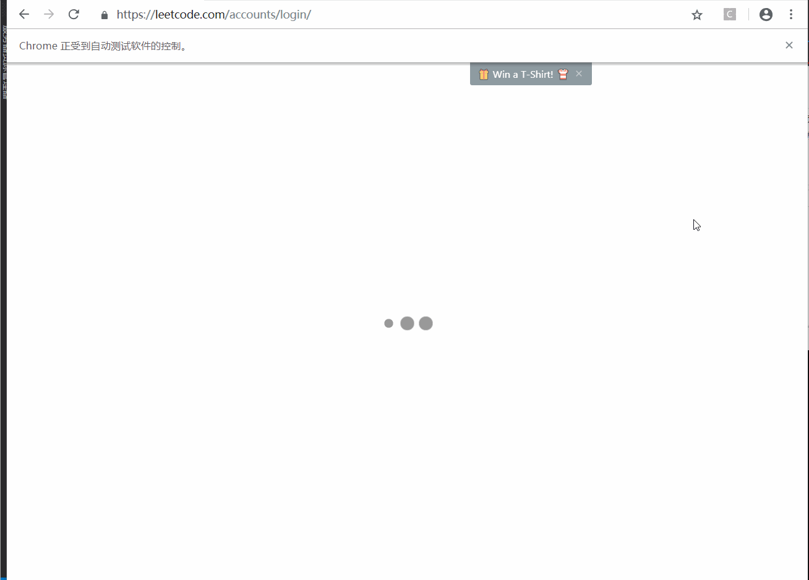

# leetcode.pull
> In case you want to grasp your former submissions.

Due to updates of LeetCode and heavily used AJAX, former method might not work anymore to retrieve your leetcode submissions. So pls use this one if you need to archive your most recent AC code:trollface:

### Setup

Pls use Python3 and install required packages

```
pip install selenium bs4 requests
```

Chrome is required and newer version should be preferred, download the [Chrome Driver](https://sites.google.com/a/chromium.org/chromedriver/) and extract it somewhere.

### Execute

Pls fill in few `TODO` items including your username and password, chrome driver path etc. Then

`python pull.py`

should be able to save your submission in `leetcode_submissions` folder.

### Modify

Modify `DURATION` if you have faster network connections and want the script do things quicker.

It's friendly for LeetCode without generate extra burden for the server and may make your life easier.

### Maintain
Unexpected things may occur especially when it become deprecated, but as a short piece of code, you could fix it or DIY it on your own:smiley:, HAVE FUN:runner:


